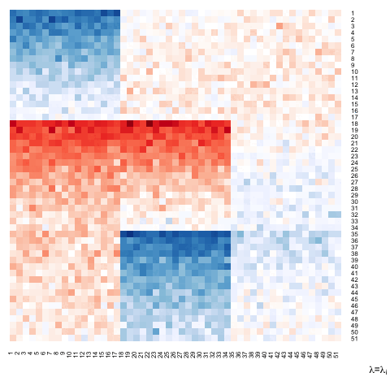

## Implementation of the model proposed in "Biclustering Multivariate Longitudinal Data with Application to a Diffusion Tensor Imaging Study".

## Installation

You can install from github using the R package [devtools] (http://cran.r-project.org/web/packages/devtools/index.html)

	install_github('longbc/clbwvr')

or clone the project from the command line

	git clone https://github.com/clbwvr/longbc.git	

## Usage

The following illustrates the usage of the main function.

```
# Fit model on simulated data
simdat = longbc::simdat
lambdas = exp(seq(log(1),log(1e4),length.out=20))
mod = longbc(simdat, lambdas=lambdas)

# Plot results
labrow = mod$fits[[i]]$cs
labcol = mod$fits[[i]]$cf
matshow(mod$fits[[i]]$Muhat,labCol=labcol, labRow=labrow)
```

<p align="center">

</p>

## Report bugs：
* open an [issue](https://github.com/clbwvr/longbc/issues) or send an email to Caleb Weaver at <clbwvr@gmail.com>